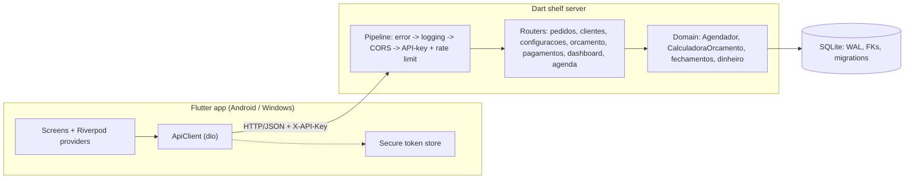

# Baray

Production-control and order-management system for a screen-printing shop: a Dart/[shelf](https://pub.dev/packages/shelf) REST API backed by SQLite, paired with a responsive Flutter client for Android and Windows.

## Context

A screen-printing shop runs on a spreadsheet until it doesn't: order intake, batch numbering, per-technique pricing, production capacity per day, delivery deadlines and per-customer billing cycles all live in the same fragile grid of formulas. Baray replaces that with a small, self-hosted service. The server owns the data and the business rules (scheduling, quoting, billing); the app is a thin, offline-friendly client that talks to it over the local network with a shared API key. It is built for a single shop on a LAN, not for multi-tenant SaaS.

## Features

**Orders**
- Full CRUD with an explicit status state machine (`pendente → agendado → producao → concluido → entregue`); illegal transitions are rejected server-side, and delivery is a dedicated atomic operation that stamps `entregue_em`.
- Sequential batch (`lote`) numbers allocated atomically via `UPDATE ... RETURNING`, so concurrent inserts never collide.
- Duplicate-order and auto-link-to-customer helpers; free-text search with `LIKE` metacharacter escaping; offset pagination with an `X-Total-Count` header.

**Automatic production scheduling**
- Places each order on the calendar by spreading its value across working days under a configurable daily capacity limit (R$/day), skipping weekends per configuration and splitting large orders across multiple days (`pedido_distribuicao`).
- Honors pinned orders (`agendamento_fixo`), computes lead time in working days, and guards against orders that exceed a year of capacity.

**Quote engine**
- Prices by printing technique × print region × quantity band from a seeded price table, with per-additional-color pricing, screen/matrix charges (waived above a threshold), garment surcharges (open/closed hoodie) and an urgency surcharge — all driven by editable settings.
- Monetary results use banker's rounding (half-even) to avoid drift in chained percentage math.

**Customers & billing cycles**
- Customer records with weekly / biweekly / monthly / fixed-day closing cycles; next-cycle dates are computed from the cycle type and day.
- Closing a cycle aggregates its orders (count, total, paid) and opens the next one; cycles can be extended; deleting a customer with open cycles is blocked unless forced.

**Payments**
- Per-order payment ledger; `valor_pago` and `status_pagamento` are recomputed as a derived cache with a one-cent tolerance, and payments are rejected when they exceed the outstanding balance.

**Dashboard & schedule**
- Month KPIs (sales, received, orders, delivered, average ticket, receivables) with a month filter aligned to UTC timestamps, plus today's production, urgent orders, overdue and upcoming deadlines, and a 7-day capacity view.
- Day-by-day occupancy over an arbitrary date range (capped at 90 days).

**Security & operations**
- Static API-key auth (`X-API-Key`, `Authorization: Bearer` accepted) with constant-time token comparison; `/health` and CORS preflight stay public.
- Per-IP sliding-window rate limiting on failed auth, returning `429` with `Retry-After`.
- Global error middleware that logs stack traces server-side and returns a generic `500` to clients; CORS origin allowlist; structured logging with optional size-based file rotation.
- Versioned SQLite migrations (8 so far) run on startup, with WAL journaling and foreign keys enabled.

**Client**
- Riverpod state management, `go_router` navigation, and a responsive shell that switches between a navigation rail (wide) and a bottom bar (compact).
- Light/dark themes, reduced-motion support (WCAG 2.3.3), Brazilian-Portuguese locale, and the Inter font bundled as an asset for offline first launch.
- The API token is stored in the platform secure store (Android Keystore / iOS Keychain) with a one-shot migration off legacy plaintext preferences; the Android release build disables cleartext HTTP.

## Tech stack

**Server** (`server/`) — Dart SDK `>= 3.4`

| Concern | Package | Version |
|---|---|---|
| HTTP server & routing | `shelf` / `shelf_router` | `^1.4.1` / `^1.1.4` |
| Persistence | `sqlite3` (SQLite, WAL) | `^3.3.1` |
| IDs | `uuid` | `^4.4.0` |
| Logging | `logging` | `^1.2.0` |
| Tests / lints | `test` / `lints` | `^1.25.0` / `^6.1.0` |

**App** (`app/`) — Flutter, Dart SDK `>= 3.11`; targets **Android** and **Windows**

| Concern | Package | Version |
|---|---|---|
| State management | `flutter_riverpod` | `^3.3.1` |
| Navigation | `go_router` | `^17.2.3` |
| HTTP client | `dio` | `^5.9.2` |
| Preferences / secure storage | `shared_preferences` / `flutter_secure_storage` | `^2.5.5` / `^10.2.0` |
| i18n & formatting | `intl` + `flutter_localizations` | `^0.20.2` |
| UI | `google_fonts` / `shimmer` | `^8.1.0` / `^3.0.0` |

## Architecture



The middleware pipeline is applied outermost-first in `server/bin/server.dart`: unhandled exceptions are caught and sanitized, every request is logged with latency, CORS headers are added, then the API key is checked (with rate limiting) before any router runs.

### HTTP API

| Area | Endpoints |
|---|---|
| Health | `GET /health` *(public)* |
| Orders | `GET/POST /pedidos`, `GET/PUT/DELETE /pedidos/{id}`, `POST /pedidos/{id}/{agendar,saida,duplicar}` |
| Customers | `GET/POST /clientes`, `GET/PUT/DELETE /clientes/{id}`, `GET /clientes/{id}/fechamentos[/{id}]`, `POST .../{id}/{fechar,estender}` |
| Settings | `GET /configuracoes`, `GET /configuracoes/proximo_lote`, `GET/PUT /configuracoes/{chave}` |
| Quotes | `GET /orcamento/{tabela,tecnicas,regioes}`, `POST /orcamento/calcular` |
| Payments | `GET/POST /pagamentos/pedidos/{pedidoId}`, `DELETE /pagamentos/{id}` |
| Dashboard | `GET /dashboard/stats` |
| Schedule | `GET /agenda/ocupacao?de=YYYY-MM-DD&ate=YYYY-MM-DD` |

## Getting started

### Prerequisites
- **Server:** the Dart SDK (`>= 3.4`) and a system SQLite library (`libsqlite3`), which the `sqlite3` package loads via FFI.
- **App:** a Flutter installation whose bundled Dart SDK is `>= 3.11`, plus the Android or Windows desktop toolchain for the target you build.

### Run the server

```bash
cd server
dart pub get
dart run bin/server.dart
```

On first start, if `BARAY_API_TOKEN` is not set, the server generates a random token and writes it to an `api_token` file next to the executable — copy that value into the app. Configuration is entirely environment-driven:

| Variable | Default | Purpose |
|---|---|---|
| `PORT` | `8080` | Listen port |
| `EMPRESA_DB` | `empresa.db` | SQLite file path |
| `BARAY_API_TOKEN` | *(generated)* | Shared API key |
| `ALLOWED_ORIGINS` | *(empty)* | Comma-separated CORS allowlist (browser dev only) |
| `AUTH_RATE_LIMIT_MAX` | `5` | Failed auths per window before `429` |
| `AUTH_RATE_LIMIT_WINDOW_SECONDS` | `60` | Rate-limit window |
| `LOG_LEVEL` | `INFO` | `SEVERE`…`FINEST` |
| `LOG_FILE` / `LOG_FILE_MAX_BYTES` / `LOG_FILE_KEEP` | *(off)* / `5 MiB` / `3` | Optional rotating file log |

### Run the app

```bash
cd app
flutter pub get
flutter run --dart-define=SERVER_URL=http://<server-host>:8080
```

The server URL and API token can also be set at runtime from the app; `SERVER_URL` only seeds the default. Build release artifacts with `flutter build apk` or `flutter build windows`.

### Tests

```bash
cd server && dart test      # unit + HTTP-pipeline integration tests
cd app    && flutter test   # money, formatting, token-migration and widget smoke tests
```

## Project structure

```
.
├── server/                     # Dart REST service
│   ├── bin/server.dart         # entrypoint: pipeline + router mounting
│   ├── lib/
│   │   ├── db.dart             # SQLite open, WAL/FK pragmas, versioned migrations
│   │   ├── auth_middleware.dart# API-key auth + constant-time compare
│   │   ├── rate_limiter.dart   # per-IP sliding-window limiter
│   │   ├── error_middleware.dart
│   │   ├── logger.dart         # logging setup + size-based rotation
│   │   ├── agendador.dart      # production scheduler
│   │   ├── calculadora_orcamento.dart  # quote engine
│   │   ├── fechamentos_util.dart       # customer billing cycles
│   │   ├── dinheiro.dart       # money rounding/comparison helpers
│   │   ├── validators.dart     # payload validation + status state machine
│   │   ├── models/             # row <-> JSON models
│   │   └── routes/             # pedidos, clientes, orcamento, pagamentos, dashboard, agenda, configuracoes
│   └── test/                   # 19 test files (+ 3 helpers)
└── app/                        # Flutter client
    ├── lib/
    │   ├── main.dart           # bootstrap: fonts, locale, provider overrides
    │   ├── router.dart         # go_router routes
    │   ├── api/api_client.dart # dio client + token/URL persistence
    │   ├── state/              # Riverpod providers
    │   ├── screens/            # dashboard, pedidos, clientes, agenda, orcamento, kanban, configuracoes
    │   ├── widgets/ · theme/ · models/ · util/
    │   └── ...
    ├── android/  windows/      # platform runners
    └── test/                   # widget + unit tests
```

## Status & limitations

This is a working system built for a specific shop, kept intentionally small.

- **Deployment target is a trusted LAN.** A single static API key gates the whole API — there are no user accounts or roles. TLS is expected to be terminated by a reverse proxy in front of the server; the Android release build blocks cleartext by default, so plain-HTTP hosts must be whitelisted per install.
- **Money is stored as SQLite `REAL`.** Rounding and comparison are centralized to keep drift below a cent, but a migration to integer cents is a known, unshipped follow-up.
- **Rate-limiter state is in-memory** and resets on restart — appropriate for a single instance, not a horizontally-scaled deployment.
- **Client platforms are Android and Windows only;** iOS/web/macOS/Linux runners are not configured.
- Some identifiers still carry the project's earlier `empresa` name (package name, default DB filename); this is cosmetic and does not affect behavior.

## License

Released under the [MIT License](LICENSE).
